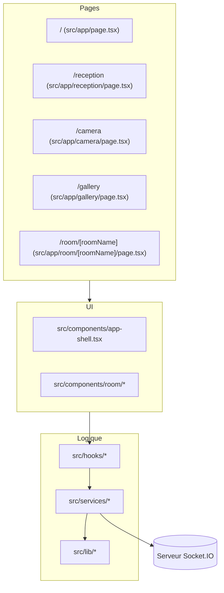

# Chat Client — Documentation technique

[← Précédent](./docs/QUALITY_GUIDE.md) | [Docs](./docs/ARCHITECTURE.md) | [Suivant →](./docs/ARCHITECTURE.md)

## Sommaire
- [Chat Client — Documentation technique](#chat-client--documentation-technique)
  - [Sommaire](#sommaire)
  - [Présentation](#présentation)
  - [Objectifs](#objectifs)
  - [Fonctionnalités majeures](#fonctionnalités-majeures)
  - [Stack technique et versions](#stack-technique-et-versions)
  - [Démarrage rapide](#démarrage-rapide)
    - [Installation](#installation)
    - [Lancer en dev](#lancer-en-dev)
  - [Variables d’environnement](#variables-denvironnement)
  - [Scripts npm](#scripts-npm)
  - [Arborescence commentée](#arborescence-commentée)
  - [Conventions de code](#conventions-de-code)
  - [Documentation](#documentation)
  - [Diagramme global](#diagramme-global)
  - [Comment tester](#comment-tester)

## Présentation
**Chat Client** est une application **Next.js (App Router)** orientée **PWA**, construite pour fonctionner **en ligne et hors ligne**, avec :
- **chat temps réel** via Socket.IO,
- **rooms dynamiques**,
- **appels audio (et vidéo optionnelle)** via WebRTC,
- **capture photo + galerie** en local,
- **persistance locale** (localStorage) pour continuer à fonctionner hors ligne.

## Objectifs
- Offrir une expérience **temps réel** pour la discussion en room.
- Garantir un **mode hors ligne** (PWA + cache + stockage local).
- Proposer des **appels WebRTC**.
- Maintenir une base de code **modulaire** (pages → components → hooks → services → lib).

## Fonctionnalités majeures
- Chat temps réel via Socket.IO (messages, infos système, participants).
- Rooms dynamiques (`/room/[roomName]`) avec liste des connectés.
- Appels audio WebRTC (vidéo optionnelle).
- Capture photo et galerie hors ligne.
- Service Worker + fallback hors ligne.
- Indicateurs appareil (selon implémentation) : batterie, localisation, etc.

## Stack technique et versions

| Brique | Version | Source |
| --- | --- | --- |
| Next.js (App Router) | 15.5.9 | `package.json` |
| React | 19.x | `package.json` |
| TypeScript | 5.x | `package.json` |
| Tailwind CSS | 4.x | `package.json` |
| HeroUI | 2.x | `package.json` |
| Socket.IO client | 4.x | `package.json` |
| Simple-Peer | 9.x | `package.json` |
| Mermaid | 11.x | rendu Markdown |

## Démarrage rapide
### Installation
```
npm install
```

### Lancer en dev
```
npm run dev
```

## Variables d’environnement
- `NEXT_PUBLIC_CHAT_SOCKET_URL` (optionnel)  
  URL du serveur Socket.IO. Par défaut : `https://api.tools.gavago.fr` (voir `src/lib/socket-client.ts`).

## Scripts npm
| Script | Description |
| --- | --- |
| `npm run dev` | Démarre Next en dev |
| `npm run build` | Build de production |
| `npm run start` | Serveur Next en prod |
| `npm run test` | Tests unitaires |
| `npm run test:e2e` | Tests e2e |
| `npm run test:ct` | Tests composants |

## Arborescence commentée
```
src/
  app/
    layout.tsx                # Layout racine (metadata, AppShell, SW)
    page.tsx                  # Accueil
    reception/page.tsx        # Profil + rooms
    camera/page.tsx           # Capture photo
    gallery/page.tsx          # Galerie hors ligne
    room/[roomName]/page.tsx  # Chat + participants + WebRTC
  components/
    app-shell.tsx             # Providers + header
    sw-init.tsx               # Service Worker registration
    room/                     # UI chat (messages, participants, call-ui)
  contexts/
    user-context.tsx          # UserProvider + hook
  hooks/
    use-chat.ts               # Hook chat (ChatService) (si présent)
    use-call.ts               # Hook calls (CallService) (si présent)
    use-socket-setup.ts       # Hook socket alternatif (si présent)
  lib/
    socket-client.ts          # Types Socket.IO + createChatSocket
    rooms.ts                  # Rooms persistées
    photo-storage.ts          # Photos localStorage
    message-storage.ts        # Messages localStorage
    notifications.ts          # Notifications via SW
  services/
    user.service.ts
    chat.service.ts
    call.service.ts
public/
  sw.js
  manifest.json
  offline.html
docs/
  ARCHITECTURE.md
  REALTIME_SOCKETIO.md
  WEBRTC_CALLS.md
  RENDERING_SSR_SSG_ISR.md
  QUALITY_GUIDE.md
```

## Conventions de code
- **Hooks** : `use-*.ts` (ex : `use-chat.ts`)
- **Services** : `*.service.ts` (ex : `chat.service.ts`)
- **Components** : `kebab-case.tsx` (ex : `app-shell.tsx`)
- **Server vs Client Components**
  - Toute API navigateur (`window`, `navigator`, `localStorage`, `mediaDevices`) → `"use client"`.
  - Éviter toute variation de rendu SSR/Client (risque de **hydration mismatch**).

## Documentation
Ordre recommandé de lecture (et navigation “Précédent/Suivant”) :
1. **Architecture** → `docs/ARCHITECTURE.md`
2. **Temps réel Socket.IO** → `docs/REALTIME_SOCKETIO.md`
3. **WebRTC (appels)** → `docs/WEBRTC_CALLS.md`
4. **Rendu SSR/SSG/ISR + SEO/Lighthouse** → `docs/RENDERING_SSR_SSG_ISR.md`
5. **Qualité & documentation** → `docs/QUALITY_GUIDE.md`

## Diagramme global


## Comment tester
1. **Chat + participants**
   - Ouvrir `/room/general` dans **2 navigateurs**.
   - Vérifier : message envoyé reçu des deux côtés.
   - Vérifier : message “INFO” à la connexion/déconnexion.
2. **Appels WebRTC**
   - Depuis la liste des participants : lancer un appel audio.
   - Tester : accepter / refuser / raccrocher.
3. **Hors ligne**
   - DevTools → **Application** → Service Worker → cocher **Offline**.
   - Recharger `/gallery` et `/camera` (et vérifier le fallback si non précaché).

[← Précédent](./docs/QUALITY_GUIDE.md) | [Docs](./docs/ARCHITECTURE.md) | [Suivant →](./docs/ARCHITECTURE.md)
