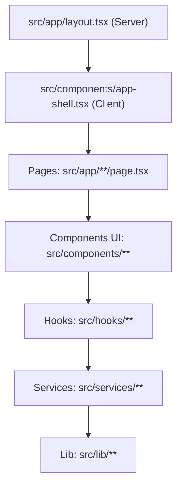
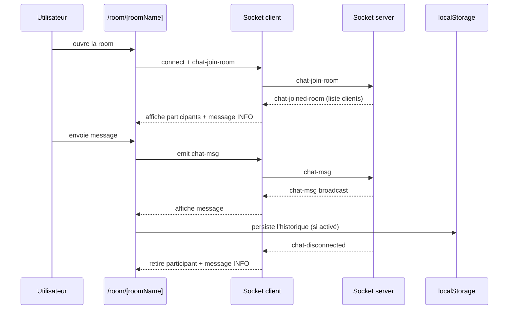

# Architecture applicative

[← Précédent](../README.md) | [Accueil / README](../README.md) | [Suivant →](./REALTIME_SOCKETIO.md)

## Sommaire
- [Architecture applicative](#architecture-applicative)
  - [Sommaire](#sommaire)
  - [Vue d’ensemble](#vue-densemble)
  - [App Router, layouts et “shell”](#app-router-layouts-et-shell)
    - [Diagramme d’empilement (layout → pages → UI)](#diagramme-dempilement-layout--pages--ui)
  - [Découpage par domaines](#découpage-par-domaines)
  - [Flux principaux](#flux-principaux)
    - [Flux Room : arrivée → messages → départ](#flux-room--arrivée--messages--départ)
  - [Gestion d’état](#gestion-détat)
  - [Hydration mismatch : règles \& pièges](#hydration-mismatch--règles--pièges)
    - [Règles](#règles)
    - [Symptômes](#symptômes)
  - [Comment tester](#comment-tester)

## Vue d’ensemble
L’application suit un découpage **App Router** :
- **Pages** (routes) → **Components UI** → **Hooks** → **Services** → **Lib**
- Objectif : limiter les effets de bord et garder une logique testable.

> ⚠️ Les APIs navigateur (localStorage, mediaDevices, WebRTC, géoloc, batterie) doivent rester dans des **Client Components**.

## App Router, layouts et “shell”
- `src/app/layout.tsx`
  - Layout racine (souvent **Server Component**).
  - Contient la structure HTML globale, metadata, et l’intégration des providers.
- `src/components/app-shell.tsx`
  - Client Component : providers UI (HeroUIProvider), contexte user, header/nav.
- `src/components/sw-init.tsx`
  - Enregistrement du Service Worker et gestion de cycle de vie (PWA/offline).

### Diagramme d’empilement (layout → pages → UI)

## Découpage par domaines
| Domaine | Exemples de fichiers | Responsabilité |
| --- | --- | --- |
| Profil utilisateur | `src/contexts/user-context.tsx`, `src/services/user.service.ts` | Stockage profil + init client |
| Chat temps réel | `src/lib/socket-client.ts`, `src/services/chat.service.ts`, `src/hooks/use-chat.ts` | Connexion, messages, participants |
| Room UI | `src/app/room/[roomName]/page.tsx`, `src/components/room/*` | UI messages, panneau participants |
| Appels WebRTC | `src/services/call.service.ts`, `src/hooks/use-call.ts`, `src/components/room/call-ui.tsx` | Appels audio/vidéo |
| PWA/hors ligne | `public/sw.js`, `public/offline.html`, `src/components/sw-init.tsx` | Cache + fallback offline |
| Stockage local | `src/lib/message-storage.ts`, `src/lib/photo-storage.ts`, `src/lib/rooms.ts` | Persistance locale |

## Flux principaux
### Flux Room : arrivée → messages → départ

## Gestion d’état
| État | Où ? | Persisté ? | Notes |
| --- | --- | --- | --- |
| Profil (pseudo/avatar) | UserContext + localStorage | Oui | Init côté client |
| Status socket | service/hook socket | Non | connecté / erreur |
| Participants | service/hook socket | Non | map id → client |
| Messages room | state page + storage | Oui (option) | utile offline |
| Call state | hook/service WebRTC | Non | phases (idle/incoming/active) |

## Hydration mismatch : règles & pièges
**But** : éviter que le HTML SSR diffère du HTML client au moment de l’hydratation.

### Règles
- Ne jamais lire `localStorage`, `window`, `navigator` dans un **Server Component**.
- Éviter `Date.now()` / `Math.random()` dans le rendu initial.
- Si une classe CSS dépend d’un état client (ex : “isTouch”), utiliser des **media queries** plutôt qu’un `if` dans le rendu.
- Toute logique “client-only” doit être dans un composant `"use client"`.

### Symptômes
- Warning React : “A tree hydrated but some attributes… didn’t match”.
- Différences sur `className`, contenu textuel, ou ordre de nœuds.

## Comment tester
1. Lancer en dev : `npm run dev`
2. Vérifier l’affichage du layout + header (AppShell)
3. Ouvrir `/room/general` (2 onglets) et valider le flux temps réel
4. Passer offline et recharger `/gallery` pour valider le fallback

[← Précédent](../README.md) | [Accueil / README](../README.md) | [Suivant →](./REALTIME_SOCKETIO.md)
