# README du code source Chat Client
[← Précédent](./QUALITY_GUIDE.md) | [Suivant →](./ARCHITECTURE.md)

## Sommaire
- [Présentation](#présentation)
- [Objectifs](#objectifs)
- [Fonctionnalités majeures](#fonctionnalités-majeures)
- [Stack technique et versions](#stack-technique-et-versions)
- [Démarrage rapide](#démarrage-rapide)
- [Variables d'environnement](#variables-denvironnement)
- [Scripts npm](#scripts-npm)
- [Arborescence commentée](#arborescence-commentée)
- [Conventions de code](#conventions-de-code)
- [Diagramme global](#diagramme-global)
- [Comment contribuer](#comment-contribuer)
- [Comment tester](#comment-tester)
- [Checklist](#checklist)

## Présentation
Ce README est le point d'entrée de la documentation technique du dossier `src/`.
Chat Client est une application Next.js (App Router) orientée PWA. Elle combine
chat temps réel, appels audio/option vidéo WebRTC, capture photo et stockage
local pour un usage hors ligne.

## Objectifs
- Offrir une expérience temps réel pour la discussion en room.
- Garantir un mode hors ligne (PWA + localStorage).
- Proposer des appels audio (et vidéo optionnelle) via WebRTC.
- Garder une base de code modulaire (pages -> components -> hooks -> services -> lib).

## Fonctionnalités majeures
- Chat temps réel via Socket.IO.
- Rooms dynamiques avec participants et historique local.
- Appels audio WebRTC, flux vidéo optionnel.
- Capture photo et galerie hors ligne.
- Service Worker Workbox avec fallback hors ligne.
- Indicateurs appareil: batterie + localisation.

## Stack technique et versions
| Brique | Version | Source |
| --- | --- | --- |
| Next.js (App Router) | 15.5.9 | `package.json` |
| React | 19.2.3 | `package.json` |
| TypeScript | 5.x | `package.json` |
| Tailwind CSS | 4.x | `package.json` |
| HeroUI | 2.8.4 | `package.json` |
| Socket.IO client | 4.8.1 | `package.json` |
| Simple-Peer | 9.11.1 | `package.json` |
| Mermaid | 11.12.2 | `package.json` |
| Workbox (SW) | 7.3.0 | `public/sw.js` |
| Playwright | 1.48 | `package.json` |
| Jest | 29.x | `package.json` |

## Démarrage rapide
### Installation
```bash
npm install
```

### Variables d'environnement
- `NEXT_PUBLIC_CHAT_SOCKET_URL` (optionnel)
  - URL du serveur Socket.IO.
  - Par défaut: `https://api.tools.gavago.fr` (voir `src/lib/socket-client.ts`).

### Scripts npm
| Script | Description |
| --- | --- |
| `npm run dev` | Démarre Next en dev sur `http://localhost:40200` |
| `npm run build` | Build de production |
| `npm run start` | Serveur Next sur `0.0.0.0:8000` |
| `npm run test` | Tests unitaires Jest |
| `npm run test:e2e` | Tests e2e Playwright |
| `npm run test:ct` | Tests component Playwright |

## Arborescence commentée
```text
src/
  app/
    layout.tsx                # Layout racine (metadata, AppShell, SW)
    page.tsx                  # Accueil
    reception/page.tsx        # Profil + rooms
    camera/page.tsx           # Capture photo
    gallery/page.tsx          # Galerie hors ligne
    room/[roomName]/page.tsx  # Chat + participants + WebRTC
  components/
    app-shell.tsx             # Providers + header
    sw-init.tsx               # Service Worker registration
    battery-indicator.tsx     # Indicateur batterie
    location-indicator.tsx    # Indicateur localisation
    phone-call-button.tsx     # Bouton tel:
    room/                     # UI chat (messages, participants, call-ui)
  contexts/
    user-context.tsx          # UserProvider + hook
  hooks/
    use-chat.ts               # Hook chat (ChatService)
    use-call.ts               # Hook calls (CallService)
    use-peer-call.ts          # Hook alternatif (non utilisé)
    use-socket-setup.ts       # Hook socket alternatif (non utilisé)
    use-battery.ts            # Battery Status API
    use-location.ts           # Geolocation API
  lib/
    socket-client.ts          # Types Socket.IO + createChatSocket
    rooms.ts                  # Rooms persistées
    photo-storage.ts          # Photos localStorage
    message-storage.ts        # Messages localStorage
    notifications.ts          # Notifications via SW
  services/
    user.service.ts           # Profil utilisateur
    chat.service.ts           # Socket.IO
    call.service.ts           # WebRTC Simple-Peer
public/
  sw.js                        # Workbox + hors ligne
  manifest.json               # PWA manifest
  offline.html                # Fallback hors ligne
```

## Conventions de code
- Nommage
  - Hooks: `use-*.ts` (ex: `src/hooks/use-chat.ts`).
  - Services: `*.service.ts` (ex: `src/services/chat.service.ts`).
  - Components: `kebab-case.tsx` (ex: `src/components/app-shell.tsx`).
- Architecture
  - Pages utilisent les components UI.
  - Components appellent des hooks.
  - Hooks délèguent aux services.
  - Services s'appuient sur `src/lib/*`.
- Server vs Client components
  - Toute dépendance navigateur (`window`, `navigator`, mediaDevices) = `"use client"`.
  - Éviter `localStorage` dans un Server Component.
  - Les pages `camera`, `gallery`, `reception`, `room` sont client-only.
- Alias de chemins
  - `@/*` mappe vers `src/*` (voir `tsconfig.json`).

## Diagramme global

```mermaid
flowchart LR
  subgraph Pages
    Home["/ (src/app/page.tsx)"]
    Reception["/reception (src/app/reception/page.tsx)"]
    Camera["/camera (src/app/camera/page.tsx)"]
    Gallery["/gallery (src/app/gallery/page.tsx)"]
    Room["/room/[roomName] (src/app/room/[roomName]/page.tsx)"]
  end

  subgraph Components
    AppShell["src/components/app-shell.tsx"]
    RoomUI["src/components/room/*"]
  end

  subgraph Hooks
    UseChat["src/hooks/use-chat.ts"]
    UseCall["src/hooks/use-call.ts"]
    UseBattery["src/hooks/use-battery.ts"]
    UseLocation["src/hooks/use-location.ts"]
  end

  subgraph Services
    UserService["src/services/user.service.ts"]
    ChatService["src/services/chat.service.ts"]
    CallService["src/services/call.service.ts"]
  end

  subgraph Lib
    SocketClient["src/lib/socket-client.ts"]
    RoomsLib["src/lib/rooms.ts"]
    MessageStore["src/lib/message-storage.ts"]
    PhotoStore["src/lib/photo-storage.ts"]
    Notifications["src/lib/notifications.ts"]
  end

  SocketServer[(Socket.IO server)]

  Pages --> Components --> Hooks --> Services --> Lib
  Services --> SocketClient --> SocketServer
  Pages --> RoomsLib
  Pages --> MessageStore
  Pages --> PhotoStore
```


## Comment contribuer
- Créer une branche courte et descriptive (ex: `feat/chat-ui`).
- Garder les PR petites et focalisées.
- Mettre à jour la doc si le flux change.
- Ajouter des tests si le comportement est modifié.

## Comment tester
1. Lancer l'app en local:
   ```bash
   npm run dev
   ```
2. Ouvrir `http://localhost:40200` et naviguer: accueil -> réception -> room.
3. Ouvrir un second navigateur pour tester les participants.
4. Tester hors ligne:
   - Ouvrir DevTools -> Application -> Service Workers.
   - Cocher `Offline`, recharger `/gallery` et `/camera`.
   - Vérifier le fallback `public/offline.html` si la page n'est pas en cache.
5. Lancer les tests:
   ```bash
   npm run test
   npm run test:e2e
   npm run test:ct
   ```

## Checklist
- [ ] Les objectifs et fonctionnalités sont à jour.
- [ ] La stack et les versions sont cohérentes avec `package.json`.
- [ ] Les chemins cités existent.
- [ ] Les diagrammes Mermaid sont valides.
- [ ] La section "Comment tester" est reproductible.
