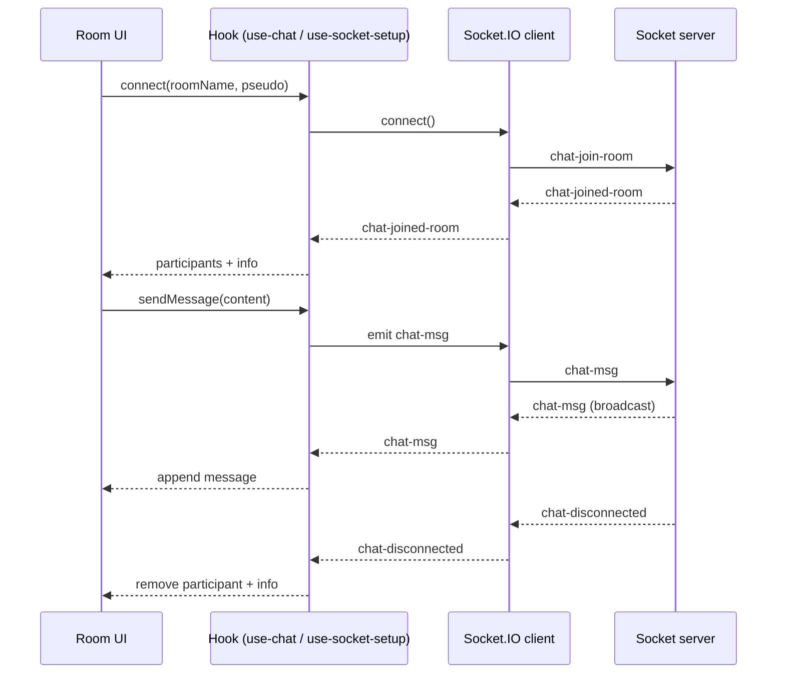

# Temps réel Socket.IO — Documentation client

[← Précédent](./ARCHITECTURE.md) | [Accueil / README](../README.md) | [Suivant →](./WEBRTC_CALLS.md)

## Sommaire
- [Temps réel Socket.IO — Documentation client](#temps-réel-socketio--documentation-client)
  - [Sommaire](#sommaire)
  - [Objectif](#objectif)
  - [Fichiers impliqués](#fichiers-impliqués)
  - [Client Socket.IO](#client-socketio)
  - [Événements serveur → client](#événements-serveur--client)
  - [Événements client → serveur](#événements-client--serveur)
  - [Flux join / message / disconnect](#flux-join--message--disconnect)
  - [Réconnexion et erreurs](#réconnexion-et-erreurs)
  - [Scénarios de test](#scénarios-de-test)
  - [Comment tester](#comment-tester)

## Objectif
Documenter le **client Socket.IO**, ses **événements**, et la façon dont la page room gère :
- les messages,
- la liste des connectés,
- les messages “INFO” à la connexion / déconnexion,
- la signalisation WebRTC via `peer-signal`.

## Fichiers impliqués
- Typage & instance socket :
  - `src/lib/socket-client.ts`
- Implémentation :
  - Option A : `src/services/chat.service.ts` + `src/hooks/use-chat.ts`
  - Option B : `src/hooks/use-socket-setup.ts`
- Intégration room :
  - `src/app/room/[roomName]/page.tsx`

## Client Socket.IO
`createChatSocket()` configure :
- `autoConnect: false` (connexion contrôlée)
- `reconnection: true` + backoff progressif
- `reconnectionAttempts: 10`
- `transports: ["websocket"]`

URL :
- `NEXT_PUBLIC_CHAT_SOCKET_URL` ou fallback `https://api.tools.gavago.fr`.

## Événements serveur → client
| Event | Payload | Rôle |
| --- | --- | --- |
| `chat-msg` | `ChatMessage` | Message utilisateur **ou** info système |
| `chat-joined-room` | `{ clients, roomName }` | Confirmation + liste participants |
| `chat-disconnected` | `{ id, pseudo?, roomName }` | Départ participant |
| `peer-signal` | `{ signal, id, roomName, pseudo, ... }` | Signal WebRTC (SDP/ICE + contrôle) |
| `error` / `erreur` | `string` | Erreur |

Exemple `chat-msg` :
```
{
  "content": "Hello",
  "pseudo": "Alice",
  "roomName": "general",
  "categorie": "MESSAGE",
  "dateEmis": "2026-01-21T10:00:00.000Z"
}
```

## Événements client → serveur
| Event | Payload | Rôle |
| --- | --- | --- |
| `chat-join-room` | `{ pseudo, roomName, avatar? }` | Rejoindre une room |
| `chat-msg` | `{ content, roomName }` | Envoyer un message |
| `peer-signal` | `{ signal, id, roomName, pseudo }` | Signal WebRTC |

## Flux join / message / disconnect


## Réconnexion et erreurs
- Socket.IO gère la reconnexion automatiquement (selon config).
- Bonne pratique : afficher un **status** (idle/connecting/connected/error).
- En cas d’erreur (`error` / `erreur`) :
  - log console,
  - afficher un toast ou un message “INFO” dans le chat.

## Scénarios de test
- 2 onglets même navigateur : join / disconnect / liste participants
- 2 navigateurs différents : propagation des messages
- réseau instable :
  - basculer offline,
  - revenir online,
  - vérifier reconnexion et nouvel envoi

## Comment tester
1. `npm run dev`
2. Ouvrir `/room/general` dans deux navigateurs
3. Envoyer un message, vérifier réception
4. Fermer un onglet, vérifier message “INFO” côté restant
5. DevTools → Network → Offline, puis Online, vérifier reconnexion

[← Précédent](./ARCHITECTURE.md) | [Accueil / README](../README.md) | [Suivant →](./WEBRTC_CALLS.md)
