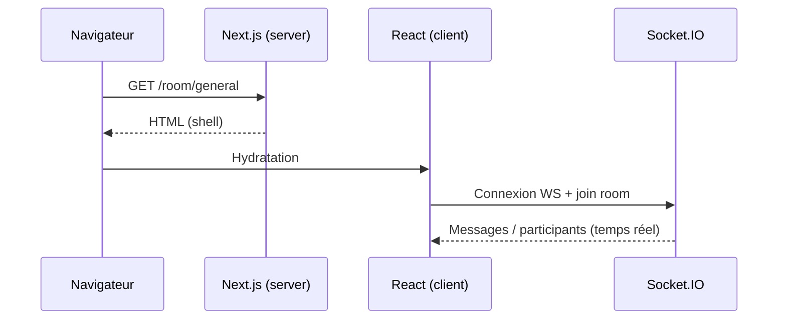

# SSR / SSG / ISR — Rendu & impacts SEO

[← Précédent](./WEBRTC_CALLS.md) | [Accueil / README](../README.md) | [Suivant →](./QUALITY_GUIDE.md)

## Sommaire
- [SSR / SSG / ISR — Rendu \& impacts SEO](#ssr--ssg--isr--rendu--impacts-seo)
  - [Sommaire](#sommaire)
  - [Définitions](#définitions)
  - [Cartographie des pages](#cartographie-des-pages)
  - [Exemples concrets par stratégie](#exemples-concrets-par-stratégie)
    - [SSR](#ssr)
    - [SSG](#ssg)
    - [ISR](#isr)
  - [Données échangées par phase](#données-échangées-par-phase)
  - [Rendu + temps réel (diagramme)](#rendu--temps-réel-diagramme)
  - [Tests (offline, view-source, Lighthouse)](#tests-offline-view-source-lighthouse)
    - [Test “view-source” / HTML initial](#test-view-source--html-initial)
    - [Test hors ligne (offline)](#test-hors-ligne-offline)
  - [Impacts SEO \& recommandations](#impacts-seo--recommandations)
    - [Impacts](#impacts)
    - [Recommandations concrètes](#recommandations-concrètes)
  - [Anti-pièges Next 15](#anti-pièges-next-15)

## Définitions
- **SSR (Server-Side Rendering)** : HTML rendu **à la requête** côté serveur.
- **SSG (Static Site Generation)** : HTML rendu **au build**, servi statiquement.
- **ISR (Incremental Static Regeneration)** : SSG + **revalidation** périodique (mise à jour selon TTL).

## Cartographie des pages
| Route | Fichier | Type (Server/Client) | Stratégie actuelle | Données principales | Offline ? | Impact SEO |
| --- | --- | --- | --- | --- | --- | --- |
| `/` | `src/app/page.tsx` | Server | SSG (idéal) | texte statique | Oui (cache) | Bon (HTML complet) |
| `/reception` | `src/app/reception/page.tsx` | Client | shell + hydratation | localStorage + saisie | Oui (cache) | Limité |
| `/camera` | `src/app/camera/page.tsx` | Client | client-only | mediaDevices | Oui (cache) | Faible |
| `/gallery` | `src/app/gallery/page.tsx` | Client | client-only | localStorage photos | Oui (cache) | Faible |
| `/room/[roomName]` | `src/app/room/[roomName]/page.tsx` | mix : page server + UI client | shell + temps réel | Socket.IO + localStorage | Partiel | Faible |

## Exemples concrets par stratégie
### SSR
- Page “publique” SEO (ex : liste de rooms publiques depuis une API) :
  - HTML complet à la requête
  - utile si tu veux indexer un annuaire (non temps réel)

### SSG
- Accueil `/` : explications + liens → parfait pour SSG.

### ISR
- Page “liste rooms” qui évolue mais pas à chaque requête :
  - revalidation (ex : 60 secondes)

## Données échangées par phase
- **Build-time** : contenu statique + assets PWA
- **Request-time** : fetch serveur (si implémenté)
- **Client-time** : Socket.IO, localStorage, APIs device

> Le temps réel Socket.IO est **client-only** : le contenu des rooms n’est pas “pré-rendable” pour l’indexation.

## Rendu + temps réel (diagramme)

## Tests (offline, view-source, Lighthouse)
### Test “view-source” / HTML initial
- Objectif : voir ce qui est **réellement rendu dans l’HTML initial**.
- Exemple :
  - `view-source:http://localhost:xxxx/`
- Sur une page client-only (gallery/camera), on ne verra qu’un “shell”.

### Test hors ligne (offline)
1. DevTools → Application → Service Workers
2. Cocher Offline
3. Recharger :
   - `/gallery` (doit fonctionner si précachée + données localStorage)
   - `/camera` (UI ok, caméra dépend du device)
4. Si non précachée : fallback `offline.html`

## Impacts SEO & recommandations
### Impacts
- SSG/SSR : meilleur contenu initial, crawlabilité plus simple.
- Client-only : contenu après hydratation → SEO plus limité.
- Room temps réel : contenu non indexable (change souvent, pas dans HTML initial).

### Recommandations concrètes
- Ajouter `metadata` par page (title/description).
- Un `h1` unique et descriptif par route.
- Vérifier `robots.txt` et `sitemap.xml` si site public.
- Pour pages client-only : afficher un texte statique minimal si possible.

## Anti-pièges Next 15
- `params` / `searchParams` peuvent être async côté Server Components.
- Éviter les hydration mismatch :
  - ne pas conditionner `className` SSR vs client
  - lire localStorage dans `useEffect`
- Contrôler cache des fetch (`cache`, `revalidate`) si tu ajoutes de la data serveur.

[← Précédent](./WEBRTC_CALLS.md) | [Accueil / README](../README.md) | [Suivant →](./QUALITY_GUIDE.md)
