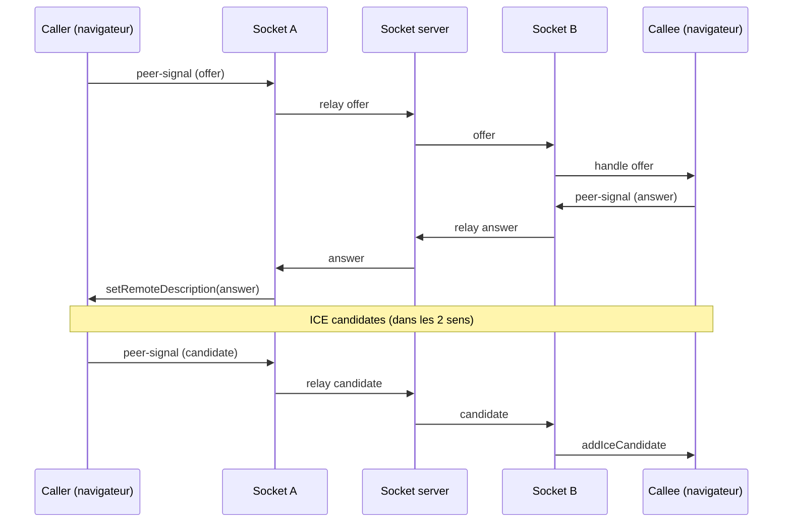

# WebRTC — Appels audio / vidéo

[← Précédent](./REALTIME_SOCKETIO.md) | [Accueil / README](../README.md) | [Suivant →](./RENDERING_SSR_SSG_ISR.md)

## Sommaire
- [WebRTC — Appels audio / vidéo](#webrtc--appels-audio--vidéo)
  - [Sommaire](#sommaire)
  - [Vue d’ensemble](#vue-densemble)
  - [Fichiers impliqués](#fichiers-impliqués)
  - [Signalisation via peer-signal](#signalisation-via-peer-signal)
  - [Formats de signaux](#formats-de-signaux)
  - [STUN / TURN](#stun--turn)
  - [Séquence offer/answer/ICE](#séquence-offeranswerice)
  - [Tests et débogage](#tests-et-débogage)
  - [Comment tester](#comment-tester)

## Vue d’ensemble
Le module WebRTC permet :
- un **appel audio** (par défaut),
- un **appel vidéo optionnel**,
- piloté via l’UI “participants” dans la room.

La signalisation (SDP + ICE + messages de contrôle) transite via Socket.IO (`peer-signal`).

> Pré-requis : HTTPS (ou localhost) + permissions micro/caméra.

## Fichiers impliqués
Selon ton implémentation :
- Socket types : `src/lib/socket-client.ts`
- Appels :
  - soit `src/services/call.service.ts` + `src/hooks/use-call.ts`
  - soit une implémentation WebRTC native dédiée
- UI :
  - `src/components/room/call-ui.tsx`
  - `src/app/room/[roomName]/page.tsx`

## Signalisation via peer-signal
- Émission : appelant → `peer-signal` vers l’ID du participant cible
- Réception : appelé → création peer + réponse (answer) + ICE candidates
- Contrôle :
  - `reject`, `hangup`, éventuellement `busy`

## Formats de signaux
Exemple d’offer :
```
{
  "id": "targetSocketId",
  "roomName": "general",
  "pseudo": "Alice",
  "signal": { "type": "offer", "sdp": "..." }
}
```

Exemple d’answer :
```
{
  "id": "targetSocketId",
  "roomName": "general",
  "pseudo": "Bob",
  "signal": { "type": "answer", "sdp": "..." }
}
```

Exemple de candidate ICE :
```
{
  "id": "targetSocketId",
  "roomName": "general",
  "pseudo": "Alice",
  "signal": { "candidate": "...", "sdpMid": "0", "sdpMLineIndex": 0 }
}
```

Signaux de contrôle :
```
{ "type": "reject" }
```

```
{ "type": "hangup" }
```

## STUN / TURN
- STUN (souvent utilisé) :
  - `stun:stun.l.google.com:19302`
  - `stun:stun1.l.google.com:19302`
- TURN : **non configuré** (souvent)
  - Limite : certains réseaux NAT stricts (entreprise/4G) peuvent échouer.
  - Si besoin : ajouter un serveur TURN (coturn) + identifiants.

## Séquence offer/answer/ICE


## Tests et débogage
- Permissions :
  - micro/caméra doivent être autorisés
  - erreurs courantes : `NotAllowedError`, `NotFoundError`
- HTTPS :
  - requis en production (secure context)
- Debug :
  - `chrome://webrtc-internals` (SDP/ICE/stats)
  - DevTools console (logs call state)

## Comment tester
1. Ouvrir `/room/general` dans deux navigateurs
2. Lancer un **appel audio**
3. Tester : accepter / refuser / raccrocher
4. Tester hors ligne :
   - Network → Offline
   - vérifier que l’appel ne peut pas s’établir et repasse en “idle”

[← Précédent](./REALTIME_SOCKETIO.md) | [Accueil / README](../README.md) | [Suivant →](./RENDERING_SSR_SSG_ISR.md)
